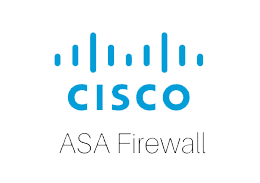

# Cisco Adaptive Security Appliance (ASA) Virtual Software Connector

## Useful Actions

### Know Your Domain

Use the Know Your Network REST APIs to GET information about clients, sites, topology, devices, and issues; Create (POST) and manage (PUT, DELETE) sites, devices, IP Pools, edge and border devices, and authentication profiles.

### Site Management

Use the Site Management APIs to do site design, adjust network settings, device onboarding, Software Image Management (SIM), Configuration Templates.

### Operational Tasks

Operational Tools enable access to manage backups, discover network devices, trace paths through the network, identify and discover network components using SNMP and other discovery protocols,

### Policy

The Cisco ASA Virtual platform enables creation of application policies used to reflect your organization's business intent and translates it into network-specific and device-specific configurations required by the different types, makes, models, operating systems, roles, and resource constraints of your network devices.

## Endpoints

Refer to the Cisco ASA Virtual connector [API specification](openapi.json) for details.

## Example Usage

< sdk example? >

## Authentication

Configuration requires your Cisco ASA Virtual Server URL, username and password. The connector automatically injects 'User-Agent' header automatically for every requests made.

Reachability to the Server URL is required in order for the connector to work properly. Please configure your firewall rules appropriately.

## Kosha Connector Open Source Development

All connectors Kosha shares on the marketplace are open source. We believe in fostering collaboration and open development. Everyone is welcome to contribute their ideas, improvements, and feedback for any Kosha connector. We encourage community engagement and appreciate any contributions that align with our goals of an open and collaborative API management platform.

Refer to the contribution guidelines for details.

## Contributing

Pull requests and bug reports are welcome.

For larger changes, please create an issue in GitHub first to discuss your proposed changes and their possible implications.